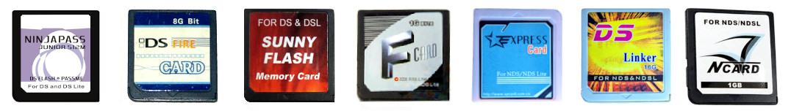

# nrioTool
_A tool for dumping hidden SRL rom sections from N-Card and it's clones._

(F-Card, Fire Card, DS-Linker and NeoFlash MK5 are known clones of N-Card). Some recovery options are also available for DLDI section of the cart.

## List of Known Carts

Tested:
- DS Fire Link (8GBit, 16GBit).
- DS-Linker (16GBit).
- ExpressCard (16GBit).

## Usage
* CIA build provided for 3DS users though this tool has not yet been tested on those consoles. (no reason to see why it wouldn't work though).
* In theory, it is possible to use this tool on a DS/DS Lite using a slot2 flashcard device of some kind, as I have tried to add code for this. But since the only slot2 device I have is a MAX Media Dock, and its DLDI driver doesn't appear to work in modern homebrew, I cannot test this.
* "nrioFiles" folder goes to SD card of your DSi/3DS console. The included FAT image is targeted for 16GBit cards and contains the default setup for N-Card XMenu 2.55/uDisk 1.45, including an updator for updating a cart to uDisk 1.45 for those who have bricked cards and can't boot it normally to run this updator. Note that while these are N-Card firmware files, they will work on almost all of the clones, as they are based off the same hardware-wise. ;)
  You can easily use a program like [WinImage](https://www.winimage.com/) to replace the files in the FAT image if you wish to use your own firmware files for this.
* "title" folder is for HiyaCFW users. Copy this into the root path of your SD card to install the title directly to your System Menu. NDS file can be used in Unlaunch for those who do not wish to do this. (regardless an Unlaunch exploited console is required to use this tool!)

## Features
* Two menus are available. The main menu and the recovery menu.
* Main Menu can do the following things: 
	1. Dump stage2 SRL.
	2. Dump hidden uDisk SRL.
	3. Do a 10000 or so sector dump of hidden section of nand. On my 16g DS Linker, there appears to be nothing but FF data after that so that's all it's set to dump for now.
	4. Do a small dump of hidden section of nand in alternate mode that contains the primary rom.
	5. Switch into Recovery Menu. Note that once you do this, you can't exit this menu without restarting the console!
* Recovery Menu can do the following things:
	1. Dump FAT sector 0.
	2. Restore sector 0. You can format this card via slot DS/DS Lite and the slot2 device connected to PC but note the card expects specific data in sector 0.
	   This tool can restore a copy of it if you have dumped a copy of it before formatting.
	3. Write default FAT image to card. An image for 16g capacity cards is included. Note that other capacities are not currently supported until FAT image jumps of them become available.
	4. Ability to boot into bootstrap program to launch files on cart. Allows booting uDisk updator as a result so can recover a bricked cart!

## Credits
lifehackerhansol: Improvements to file read logic.

SylverReZ: Troubleshooting bugs.
